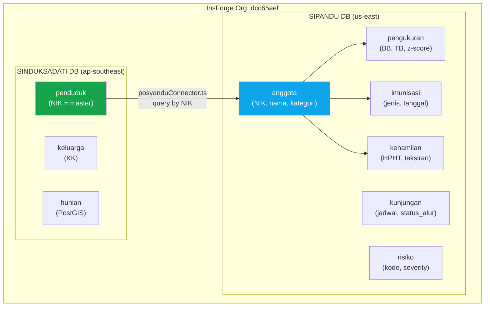

# SIPANDU Re-Audit + Rencana Integrasi Database SINDUKSADATI

---

## Bagian A: Hasil Re-Audit SIPANDU (9 Sep 2026 — Sesi 2)

### Status Build Terkini

| Metric | Sebelumnya | Sekarang | Status |
|--------|-----------|----------|--------|
| TypeCheck | ✅ Pass | ✅ Pass | Sama |
| Unit Tests | ✅ 47/47 | ✅ 47/47 | Sama |
| **Main Chunk Size** | ⚠️ **929 KB** | ✅ **475 KB** | **↓ 49% reduction!** |
| Code Splitting | ❌ Tidak ada | ✅ **30 lazy routes** | Fixed |
| Error Boundary | ❌ Missing | ✅ Tersedia | Fixed |
| Chunk Count | 2 chunks | **29 chunks** | Optimal |

### Verifikasi Temuan Kritis (P0)

| # | Item | Status | Detail |
|---|------|--------|--------|
| K1 | Error Boundary | ✅ **FIXED** | [ErrorBoundary.tsx](file:///C:/FLUTTER%20PROJEK/gabut/sipandu/src/components/ErrorBoundary.tsx) (71 baris) dibuat, membungkus root di [main.tsx](file:///C:/FLUTTER%20PROJEK/gabut/sipandu/src/main.tsx) |
| K2 | Bundle Size 929 KB | ✅ **FIXED** | Turun ke 475 KB (gzip: 134 KB). 30 route di-lazy-load. Landing page = 80 KB terpisah |
| K3 | data-store.tsx monolitik | ⚠️ **BELUM** | Masih 1,050+ baris, semua `any` types |
| K4 | Pervasive `any` types | ⚠️ **BELUM** | `DataStoreState` masih semua `any[]` |
| K5 | Password hint visible | ✅ **FIXED** | Quick-login, hint `password123`, dan Role Selector semua ter-gate `DEMO_MODE` |
| K6 | Go-live checklist items | — | Belum dicek satu per satu |

### Verifikasi Temuan Sedang (P1)

| # | Item | Status |
|---|------|--------|
| S2 | Monitoring.tsx dead code | ✅ **FIXED** — File dihapus |
| S7 | Laporan dropdown hardcoded | ⚠️ **BELUM** — Masih 3 option hardcoded |

> [!TIP]
> **Kesimpulan**: 4 dari 6 item P0 sudah diperbaiki dengan baik. Bundle size turun 49% — ini perbaikan signifikan. Yang tersisa (K3/K4: type safety) dan S7 (dropdown) bisa dikerjakan di iterasi berikutnya.

---

## Bagian B: Rencana Integrasi Database SIPANDU ↔ SINDUKSADATI

### Konteks & Arsitektur Saat Ini

Kedua project berada di **organisasi InsForge yang sama** tapi **database terpisah**:



### Yang Sudah Ada

SINDUKSADATI **sudah punya** infrastruktur integrasi:

| Komponen | File | Status |
|----------|------|--------|
| Connector ke SIPANDU DB | [posyanduConnector.ts](file:///C:/FLUTTER%20PROJEK/gabut/sinduksadati/src/lib/services/integrations/posyanduConnector.ts) | ✅ Ada, tapi perlu perbaikan |
| API endpoint `/ecosystem/sipandu` | [route.ts](file:///C:/FLUTTER%20PROJEK/gabut/sinduksadati/src/app/api/v1/ecosystem/sipandu/route.ts) | ✅ Ada |
| Federated Citizen 360 hub | [federatedHub.ts](file:///C:/FLUTTER%20PROJEK/gabut/sinduksadati/src/lib/services/integrations/federatedHub.ts) | ✅ Ada |
| Type `SipanduRecord` | [types/index.ts](file:///C:/FLUTTER%20PROJEK/gabut/sinduksadati/src/types/index.ts#L137-L158) | ✅ Ada |
| Env vars `POSYANDU_*` | [.env.local](file:///C:/FLUTTER%20PROJEK/gabut/sinduksadati/.env.local#L7-L10) | ✅ Ada & terisi |
| UI halaman SIPANDU warga | `warga/sipandu/page.tsx` | ✅ Ada |

### Masalah yang Ditemukan

Koneksi **sudah bisa jalan** tapi ada **5 masalah** yang membuat data tidak terbaca dengan benar:

---

#### Masalah 1: Kolom Pengukuran Tidak Cocok

[posyanduConnector.ts](file:///C:/FLUTTER%20PROJEK/gabut/sinduksadati/src/lib/services/integrations/posyanduConnector.ts#L110-L120) membaca kolom yang **salah** dari database SIPANDU:

```typescript
// ❌ posyanduConnector.ts membaca:
record.berat_badan_kg = p.berat_kg ?? p.berat_badan_kg ?? undefined;
record.z_score_bb_u = p.z_score_bb_u ?? undefined;
record.z_score_tb_u = p.z_score_tb_u ?? undefined;

// ✅ Kolom sebenarnya di SIPANDU (tabel pengukuran):
// berat_badan (bukan berat_kg/berat_badan_kg)
// tinggi_badan (bukan tinggi_cm/tinggi_badan_cm)
// z_score_bbu (bukan z_score_bb_u)
// z_score_tbu (bukan z_score_tb_u)
```

#### Masalah 2: Query `pengukuran` Tidak Melalui `kunjungan`

Di SIPANDU, `pengukuran` terhubung ke `anggota` melalui `kunjungan` (via `kunjungan_id`), **bukan** langsung via `anggota_id`. Connector query `pengukuran.anggota_id` yang **tidak ada** di tabel.

```
anggota → kunjungan (anggota_id) → pengukuran (kunjungan_id)
```

#### Masalah 3: Kredensial Auth Tidak Cocok

```
# .env.local SINDUKSADATI:
POSYANDU_EMAIL=admin@sipandu.id        ← ❌ Email ini tidak ada di SIPANDU
POSYANDU_PASSWORD=admin123              ← ❌ Password ini bukan yang benar

# Email yang valid di SIPANDU seed:
admin@sipandu-flamboyan.id (super_admin)
```

#### Masalah 4: Data Risiko dan Kunjungan Tidak Terambil

`SipanduRecord` type tidak menyertakan data yang sangat berguna:
- Riwayat kunjungan/kehadiran (untuk tracking D/S)
- Risiko klinis aktif (R-B01 s.d R-L06)
- Status pelayanan (vitamin A, PMT, rujukan)
- Catatan kader/bidan

#### Masalah 5: Kategori Mapping Tidak Lengkap

```typescript
// ❌ posyanduConnector.ts:
if (kategori === "bumil") return "Ibu Hamil (Bumil ILP)";

// ✅ SIPANDU sudah normalisasi ke "ibu_hamil" (bukan "bumil")
// Juga missing: "wus" dan "umum"
```

---

## Proposed Changes

### Komponen 1: SINDUKSADATI — Fix PosyanduConnector

#### [MODIFY] `posyanduConnector.ts`

Perbaikan utama pada connector agar sesuai dengan skema database SIPANDU yang sebenarnya:

```typescript
// src/lib/services/integrations/posyanduConnector.ts

import { createClient } from "@insforge/sdk";
import { SipanduRecord } from "@/types";

const POSYANDU_INSFORGE_URL = (process.env.POSYANDU_INSFORGE_URL && process.env.POSYANDU_INSFORGE_URL !== "[SENSITIVE]")
  ? process.env.POSYANDU_INSFORGE_URL
  : "https://6i9ja6g9.us-east.insforge.app";
const POSYANDU_INSFORGE_KEY = (process.env.POSYANDU_INSFORGE_ANON_KEY && process.env.POSYANDU_INSFORGE_ANON_KEY !== "[SENSITIVE]")
  ? process.env.POSYANDU_INSFORGE_ANON_KEY
  : "anon_c96fb04fdf42783ed160148118711f6b909f25fffeb3440ccc650a2996907cc6";

class PosyanduConnectorService {
  private client: any;
  private authPromise: Promise<boolean> | null = null;

  constructor() {
    try {
      this.client = createClient({
        baseUrl: POSYANDU_INSFORGE_URL,
        anonKey: POSYANDU_INSFORGE_KEY,
      });
    } catch (e) {
      console.warn("Posyandu client init warning:", e);
    }
  }

  private async ensureAuthenticated(): Promise<boolean> {
    if (this.authPromise) return this.authPromise;

    this.authPromise = (async () => {
      try {
        if (!this.client) return false;
        // ✅ FIX: Gunakan credential yang cocok dengan SIPANDU auth.users
        const email = (process.env.POSYANDU_EMAIL && process.env.POSYANDU_EMAIL !== "[SENSITIVE]")
          ? process.env.POSYANDU_EMAIL
          : "admin@sipandu-flamboyan.id";
        const password = (process.env.POSYANDU_PASSWORD && process.env.POSYANDU_PASSWORD !== "[SENSITIVE]")
          ? process.env.POSYANDU_PASSWORD
          : "password123";

        const res = await this.client.auth.signInWithPassword({ email, password });
        return !res.error;
      } catch (e) {
        console.warn("Posyandu auto-auth exception:", e);
        return false;
      }
    })();

    return this.authPromise;
  }

  private mapKategori(kategori?: string): string {
    // ✅ FIX: Mapping lengkap sesuai normalisasi SIPANDU
    switch (kategori) {
      case "bayi": return "Bayi (0–11 Bulan)";
      case "balita": return "Balita (12–59 Bulan)";
      case "ibu_hamil": return "Ibu Hamil (ILP)";    // SIPANDU pakai "ibu_hamil", bukan "bumil"
      case "wus": return "WUS (15–49 Tahun)";
      case "lansia": return "Lansia (≥60 Tahun)";
      case "umum": return "Dewasa (Usia Produktif)";
      default: return "Tidak Terkategorikan";
    }
  }

  async getLiveHealthRecordByNIK(nik: string): Promise<SipanduRecord | null> {
    try {
      if (!this.client) return null;
      await this.ensureAuthenticated();

      // 1. Find Anggota by NIK
      const { data: anggotaList, error: anggotaErr } = await this.client.database
        .from("anggota")
        .select("*")
        .eq("nik", nik);

      if (anggotaErr || !anggotaList || anggotaList.length === 0) return null;
      const a = anggotaList[0];

      const record: SipanduRecord = {
        nama_sasaran: a.nama,
        kategori_sasaran: this.mapKategori(a.kategori),
        tgl_pemeriksaan_terakhir: "",
        status_kemandirian: a.status_kemandirian ?? undefined,
      };

      // 2. ✅ FIX: Pengukuran terakhir — harus melalui kunjungan
      //    Path: anggota → kunjungan (anggota_id) → pengukuran (kunjungan_id)
      const { data: kunjunganList } = await this.client.database
        .from("kunjungan")
        .select("id, waktu_hadir, status_verifikasi")
        .eq("anggota_id", a.id)
        .order("waktu_hadir", { ascending: false })
        .limit(5);

      if (kunjunganList && kunjunganList.length > 0) {
        const latestVisitId = kunjunganList[0].id;
        record.tgl_pemeriksaan_terakhir = kunjunganList[0].waktu_hadir || "";

        // ✅ FIX: Query pengukuran via kunjungan_id, bukan anggota_id
        const { data: pengukuranList } = await this.client.database
          .from("pengukuran")
          .select("*")
          .eq("kunjungan_id", latestVisitId)
          .limit(1);

        if (pengukuranList && pengukuranList.length > 0) {
          const p = pengukuranList[0];
          // ✅ FIX: Nama kolom sesuai skema SIPANDU yang sebenarnya
          record.berat_badan_kg = p.berat_badan ?? undefined;
          record.tinggi_badan_cm = p.tinggi_badan ?? undefined;
          record.lingkar_kepala_cm = p.lingkar_kepala ?? undefined;
          record.z_score_bb_u = p.z_score_bbu ?? undefined;
          record.z_score_tb_u = p.z_score_tbu ?? undefined;
          record.tensi_darah = p.tekanan_darah ?? undefined;
          record.gula_darah_puasa = p.gula_darah_sewaktu != null
            ? String(p.gula_darah_sewaktu)
            : undefined;
          record.catatan_kader = p.catatan_kader ?? undefined;

          // Derive status gizi dari z-score BB/U
          if (p.z_score_bbu != null) {
            const z = p.z_score_bbu;
            record.status_gizi = z < -3 ? "Gizi Buruk"
              : z < -2 ? "Gizi Kurang"
              : z > 2 ? "Gizi Lebih"
              : "Normal";
          }

          // Derive status stunting dari z-score TB/U
          if (p.z_score_tbu != null) {
            const z = p.z_score_tbu;
            record.status_stunting = z < -3 ? "Stunting Berat"
              : z < -2 ? "Stunting"
              : "Normal";
          }
        }

        // ✅ NEW: Hitung total kunjungan untuk tracking kehadiran
        record.total_kunjungan = kunjunganList.length;
      }

      // 3. Imunisasi terakhir
      const { data: imunisasiList } = await this.client.database
        .from("imunisasi")
        .select("jenis, tanggal")
        .eq("anggota_id", a.id)
        .order("tanggal", { ascending: false })
        .limit(5);

      if (imunisasiList && imunisasiList.length > 0) {
        const jenisList = imunisasiList.map((i: any) => i.jenis).filter(Boolean);
        if (jenisList.length > 0) record.status_imunisasi = jenisList.join(", ");
      }

      // 4. ✅ FIX: Kehamilan — kategori "ibu_hamil" (bukan "bumil")
      if (a.kategori === "ibu_hamil" || a.status_hamil) {
        const { data: hamilList } = await this.client.database
          .from("kehamilan")
          .select("*")
          .eq("anggota_id", a.id)
          .eq("status", "aktif")
          .order("created_at", { ascending: false })
          .limit(1);

        if (hamilList && hamilList.length > 0) {
          const h = hamilList[0];
          record.hpl = h.taksiran_persalinan ?? undefined;
          // Hitung usia kehamilan dari HPHT
          if (h.tanggal_hpht) {
            const hpht = new Date(h.tanggal_hpht);
            const now = new Date();
            const diffDays = Math.floor((now.getTime() - hpht.getTime()) / (1000 * 60 * 60 * 24));
            record.usia_kehamilan_minggu = Math.floor(diffDays / 7);
          }
        }
      }

      // 5. ✅ NEW: Risiko aktif
      const { data: risikoList } = await this.client.database
        .from("risiko")
        .select("kode_risiko, deskripsi, severity, status")
        .eq("anggota_id", a.id)
        .eq("status", "aktif")
        .limit(5);

      if (risikoList && risikoList.length > 0) {
        const dangerRisks = risikoList.filter((r: any) => r.severity === "danger");
        const warningRisks = risikoList.filter((r: any) => r.severity === "warning");
        
        if (dangerRisks.length > 0) {
          record.status_risiko = `⚠️ ${dangerRisks.length} risiko tinggi: ${dangerRisks.map((r: any) => r.kode_risiko).join(", ")}`;
        } else if (warningRisks.length > 0) {
          record.status_risiko = `${warningRisks.length} peringatan: ${warningRisks.map((r: any) => r.kode_risiko).join(", ")}`;
        }
      }

      // Hitung usia dari tanggal lahir
      if (a.tanggal_lahir) {
        const birthDate = new Date(a.tanggal_lahir);
        const now = new Date();
        const totalMonths = (now.getFullYear() - birthDate.getFullYear()) * 12
          + (now.getMonth() - birthDate.getMonth());
        record.usia_bulan = totalMonths;
        record.usia_tahun = Math.floor(totalMonths / 12);
      }

      return record;
    } catch (e) {
      console.warn("Error querying live SIPANDU database:", e);
    }

    return null;
  }
}

export const PosyanduConnector = new PosyanduConnectorService();
```

---

### Komponen 2: SINDUKSADATI — Update Type `SipanduRecord`

#### [MODIFY] `types/index.ts`

Tambah field baru ke interface:

```diff
 export interface SipanduRecord {
   nama_sasaran: string;
   kategori_sasaran: string;
   usia_bulan?: number;
   usia_tahun?: number;
   status_gizi?: string;
   status_stunting?: string;
   z_score_bb_u?: number;
   z_score_tb_u?: number;
   berat_badan_kg?: number;
   tinggi_badan_cm?: number;
   lingkar_kepala_cm?: number;
   tgl_pemeriksaan_terakhir: string;
   status_imunisasi?: string;
   usia_kehamilan_minggu?: number;
   hpl?: string;
   status_risiko?: string;
   tensi_darah?: string;
   gula_darah_puasa?: string;
   status_kemandirian?: string;
   catatan_kader?: string;
+  total_kunjungan?: number;
 }
```

---

### Komponen 3: SINDUKSADATI — Fix Environment Variables

#### [MODIFY] `.env.local`

```diff
 # Posyandu
 POSYANDU_INSFORGE_URL=https://6i9ja6g9.us-east.insforge.app
 POSYANDU_INSFORGE_ANON_KEY=anon_c96fb04fdf42783ed160148118711f6b909f25fffeb3440ccc650a2996907cc6
-POSYANDU_EMAIL=admin@sipandu.id
-POSYANDU_PASSWORD=admin123
+POSYANDU_EMAIL=admin@sipandu-flamboyan.id
+POSYANDU_PASSWORD=password123
```

> [!CAUTION]
> Credential `password123` ini adalah default demo. Untuk produksi, buat akun service-account khusus di SIPANDU dengan email seperti `ecosystem@sipandu-flamboyan.id` dan password unik yang kuat.

---

## User Review Required

> [!IMPORTANT]
> **Keputusan Arsitektur**: Saat ini `posyanduConnector.ts` menggunakan **direct database access** (SINDUKSADATI login ke SIPANDU InsForge DB lalu query langsung). Alternatif lainnya adalah **API-based** (SIPANDU expose REST endpoint yang di-call SINDUKSADATI). Direct DB access lebih simpel untuk tahap ini, tapi kurang aman untuk produksi. Mau tetap pakai direct DB access atau mau saya buatkan API endpoint juga?

> [!WARNING]
> **Credential Exposure**: File `.env.local` SINDUKSADATI berisi banyak secret (JWT, InsForge API key, Supabase service role key). Pastikan file ini **tidak** ter-commit ke git.

---

## Open Questions

> [!IMPORTANT]
> **Q1**: Apakah sudah ada akun `admin@sipandu-flamboyan.id` yang terdaftar di InsForge auth SIPANDU? Jika belum, kita perlu buat dulu via InsForge dashboard atau CLI.

> [!IMPORTANT]
> **Q2**: Apakah Anda ingin data SIPANDU juga bisa **menulis** ke SINDUKSADATI (misalnya update status_hamil, alamat)? Atau cukup **baca saja** (satu arah: SINDUKSADATI baca SIPANDU)?

> [!NOTE]
> **Q3**: Apakah tabel `pengukuran` di SIPANDU sudah memiliki kolom `anggota_id` secara langsung, atau memang harus melalui join `kunjungan`? Ini menentukan query path yang benar.

---

## Verification Plan

### Automated Tests
```bash
# SIPANDU - pastikan masih passing
cd "C:\FLUTTER PROJEK\gabut\sipandu"
npm run typecheck && npm test && npm run build

# SINDUKSADATI - pastikan masih passing
cd "C:\FLUTTER PROJEK\gabut\sinduksadati"  
npm run typecheck && npm run build
```

### Manual Verification
1. Jalankan SINDUKSADATI dev server (`npm run dev`)
2. Login sebagai admin_rw
3. Buka halaman Citizen 360 untuk warga yang NIK-nya ada di SIPANDU
4. Verifikasi bahwa data kesehatan (berat/tinggi/z-score/imunisasi) muncul dengan benar
5. Cek endpoint: `GET /api/v1/ecosystem/sipandu?nik=<NIK_16_DIGIT>`
